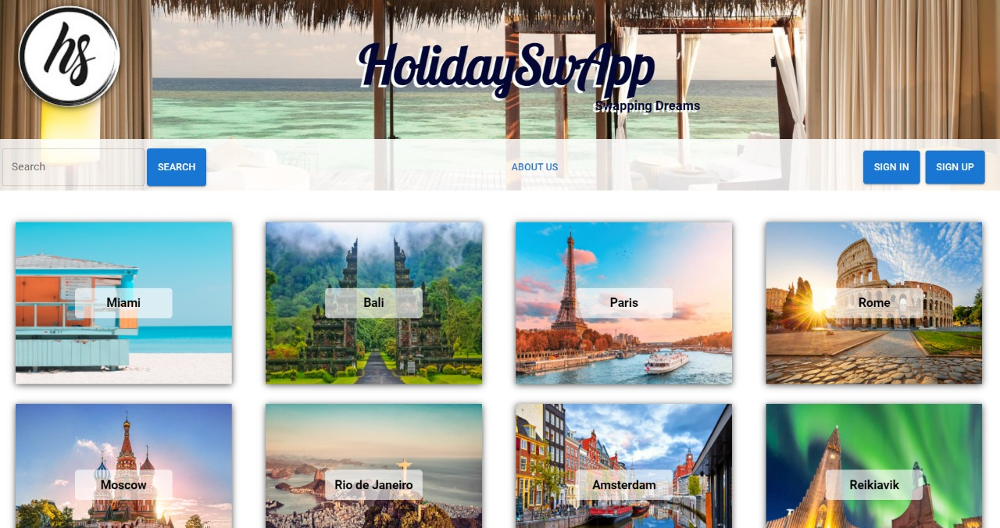
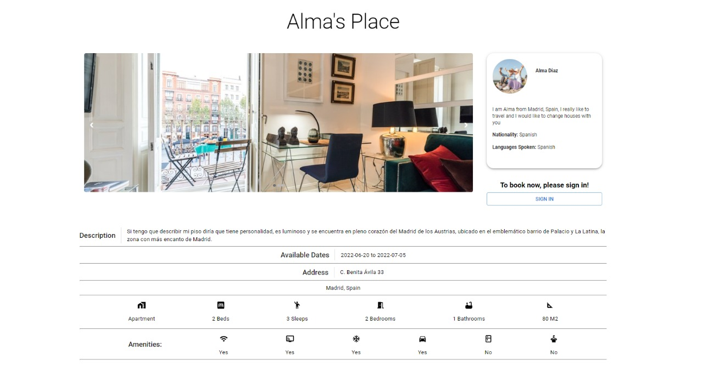
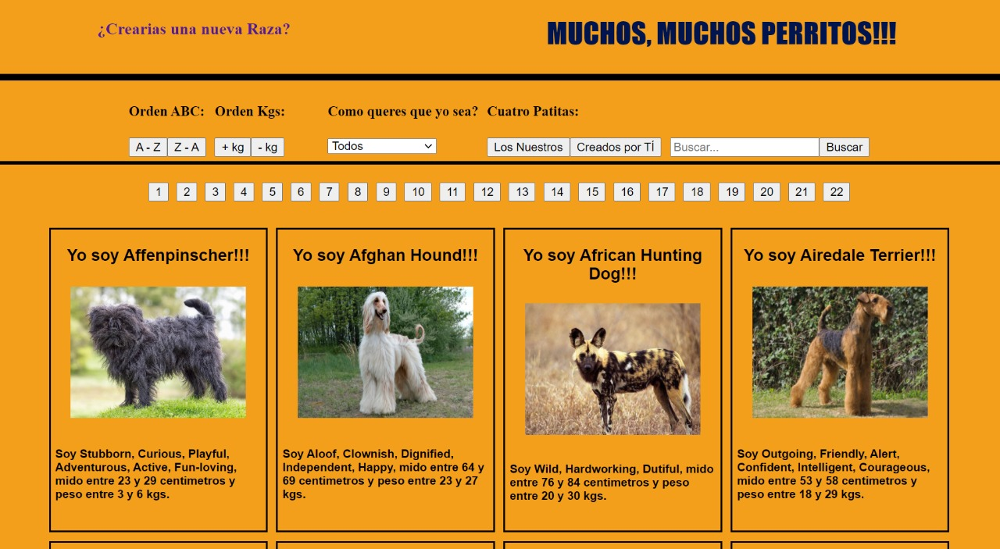
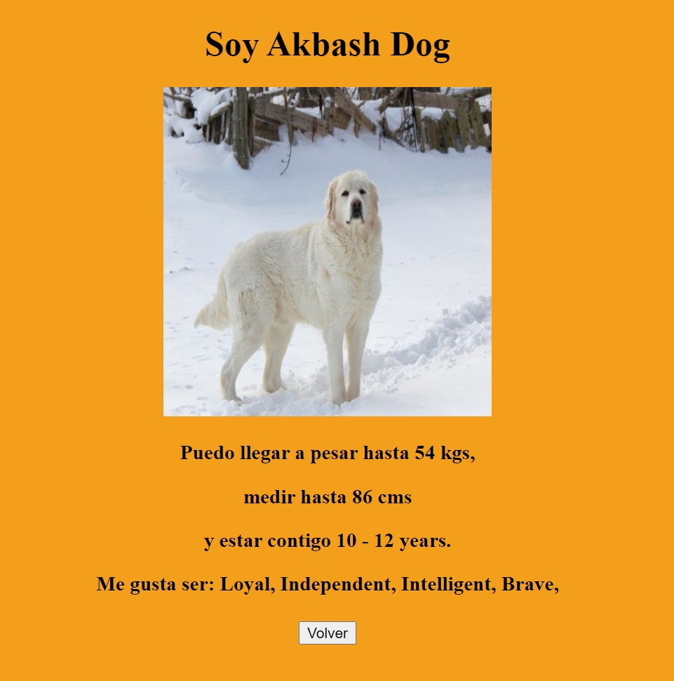

### Hola! Soy matias!

Mi enfoque resolutivo y mi atención al detalle garantizan la calidad en cada proyecto en el que trabajo. Con experiencia en el uso de metodologías ágiles como Scrum, soy capaz de enfrentar desafíos complejos y encontrar soluciones efectivas.

Me encanta mantenerme actualizado en las últimas tecnologías y tendencias en el desarrollo web, y estoy constantemente aprendiendo y mejorando mis habilidades a través de cursos en línea y proyectos personales.

En mi trabajo, destaco por mi capacidad para trabajar en equipo de manera colaborativa, mi comunicación efectiva y mi enfoque orientado al cliente. Siempre busco la satisfacción del usuario final, y considero que la retroalimentación constructiva es una oportunidad para crecer y mejorar.

Si estás buscando un desarrollador Full Stack apasionado y comprometido para tu proyecto, ¡no dudes en contactarme! Estoy emocionado de contribuir con mis habilidades y experiencia para alcanzar el éxito conjunto.

Puedes echar un vistazo a mis proyectos anteriores y explorar mi código en GitHub. ¡Conéctate conmigo y exploremos cómo podemos colaborar juntos en emocionantes proyectos de desarrollo web! 🚀

 
<h2>TECNOLOGIAS A MI ALCANCE:</h2>
 

    <code>
        
        
        
        
        
        
        
        
        
        
        
    </code>

<h2>ALGUNOS TRABAJOS:</h2>
<h4>Proyecto grupal:<a href="https://holidayswapp.vercel.app/"> HolidaySwapp</a></h4>

  
   
  

<h4>Proyecto individual:</h4>

  
   
  

 

<h2>📫 Contactame</h2>
<a href="https://github.com/Mati69lbt/">GITHUB</a>
 
<a href="mati69_lbt@hotmail.com"> HOTMAIL</a>
 
<a href="https://www.linkedin.com/in/matiasdelgadodev/">LINKEDIN</a>
 
<a href="https://matiasdelgado.onrender.com/">PORTFOLIO</a>

<!--
**Mati69lbt/Mati69lbt** is a ✨ _special_ ✨ repository because its `README.md` (this file) appears on your GitHub profile.

Here are some ideas to get you started:

- 🔭 I’m currently working on ...
- 🌱 I’m currently learning ...
- 👯 I’m looking to collaborate on ...
- 🤔 I’m looking for help with ...
- 💬 Ask me about ...
- 📫 How to reach me: ...
- 😄 Pronouns: ...
- ⚡ Fun fact: ...
-->
